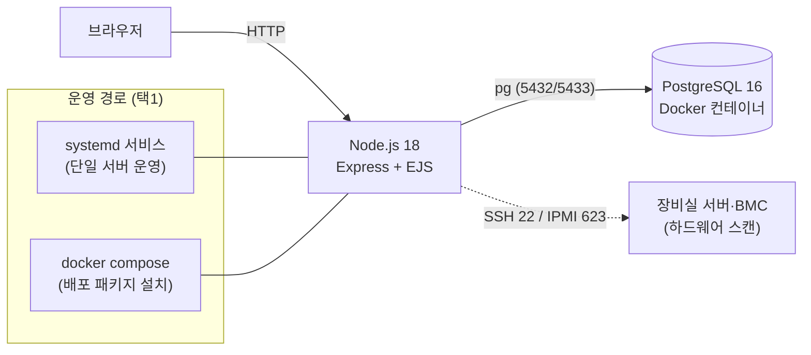
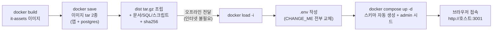

# HPC IT Management

HPC/AIDC 장비실의 서버·랙·부품·IP·입출고를 웹에서 통합 관리하는 IT 자산관리 시스템.


<!-- TODO: 스크린샷 -->

## 주요 기능

- **자산 관리** — 서버/스위치/스토리지 등 등록·수정·이력, 관리번호/자산번호 체계, 사진 첨부
- **랙 실장 관리** — 서버실→랙→자산 배치를 홀(1/3U) 단위로 정밀 표현, 실장도 시각화, 위치 충돌 검사
- **IP 관리** — 서브넷 CRUD(CIDR /16~/30)·IP 풀 자동 생성·할당 현황, 자산 IP 자동 동기화
- **입출고/이력** — 입고·사용등록·반납·폐기 수명주기, append-only 사용 이력(이벤트 소싱)
- **부품 재고** — CPU/메모리/디스크 등 모듈 단위 재고·설치 현황·이동 이력
- **하드웨어 자동 수집** — SSH/IPMI 스캔으로 사양·PSU 자동 갱신(변경분만 기록)
- **감사 로그** — 전 화면 변경 이력 추적(누가·무엇을·언제)
- **통합 검색** — 장비명·IP·관리번호/자산번호·사용자 즉시 검색
- 대여 관리, 업체 반입 접수, 사무실/보관 장비 뷰

## 아키텍처



## 배포 흐름 (오프라인 전제)



## 빠른 시작

```bash
docker load -i it-assets-2.0.2.tar && docker load -i postgres-16-alpine.tar
cp .env.example .env   # CHANGE_ME 값 전부 교체 (아래 필수 키)
docker compose -f docker-compose.prod.yml up -d
# 접속: http://<서버IP>:3001 — 최초 로그인 admin / <INITIAL_ADMIN_PASSWORD>
```

필수 `.env` 키(미설정/기본값이면 기동 차단): `POSTGRES_PASSWORD`,
`SESSION_SECRET`(32자+ 무작위, 예: `openssl rand -hex 32`), `INITIAL_ADMIN_PASSWORD`.

상세 설치·업그레이드·백업 절차: **[v2/DEPLOY.md](v2/DEPLOY.md)**

## 버전

- 현재: **2.0.2** — [릴리스 노트](v2/RELEASE_NOTICE_2.0.2.md)
  (2.0.1: [노트](v2/RELEASE_NOTICE_2.0.1.md))
- 스키마 마이그레이션: [v2/db/migrations/](v2/db/migrations/)
